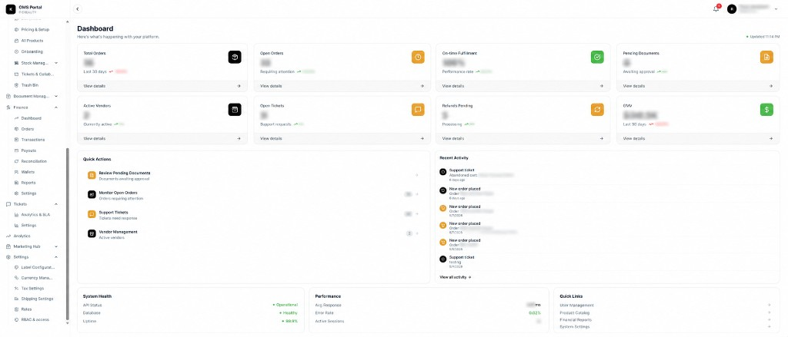
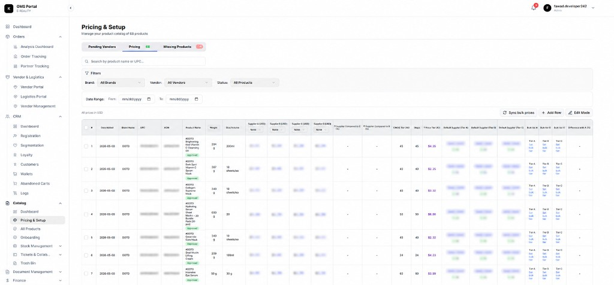
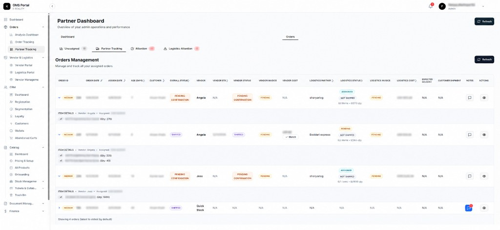
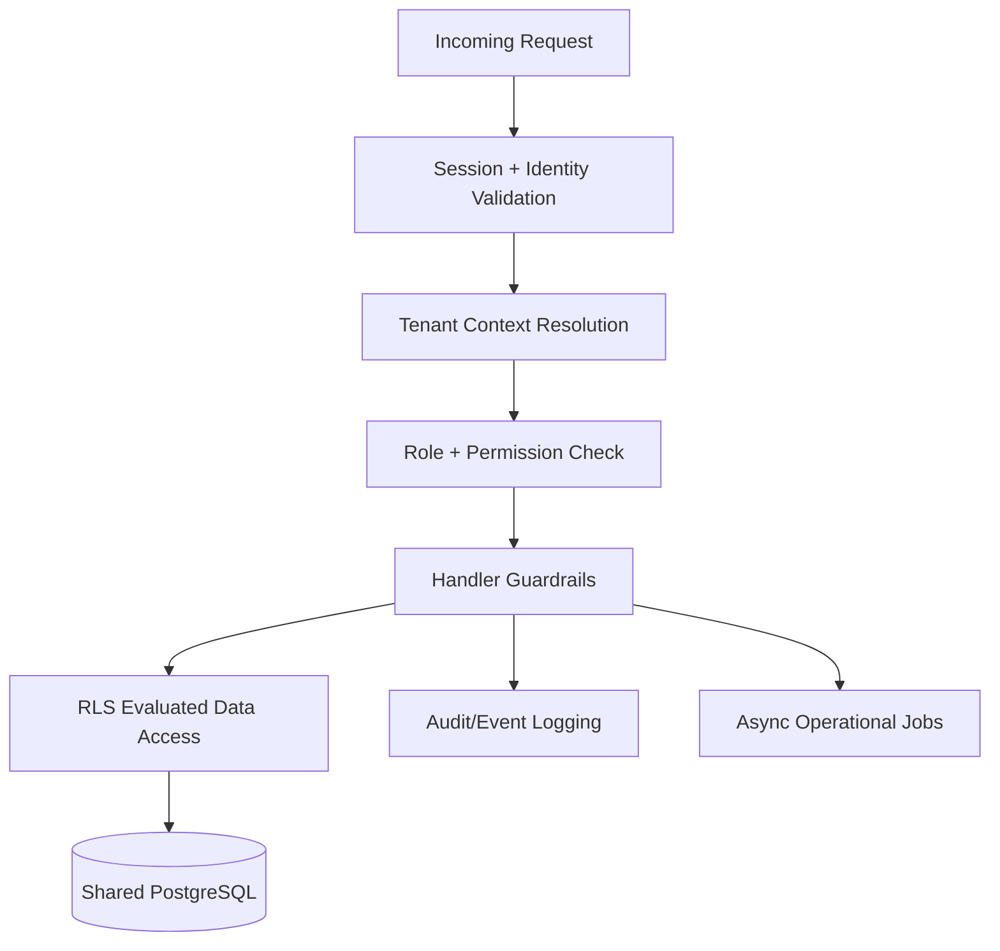

# Multi-Tenant SaaS Architecture

<p align="center">
  
</p>

<p align="center">
  
  
  
  
</p>

<p align="center">
  Generalized architecture patterns inspired by real production SaaS engineering work, focused on tenant-aware backend design, permission boundaries, and operational safety.
</p>

---

## 🧠 Overview

This repository documents production-inspired multi-tenant SaaS architecture patterns for:

- organization and workspace-aware access boundaries
- layered authorization (session, RBAC, and data policy checks)
- backend modularity for complex operational domains
- auditability, onboarding reliability, and scaling trade-offs

The goal is systems design realism, not a full product implementation.

<p align="center">
  
</p>

---

## 🧭 Production SaaS Context

This repository is informed by generalized lessons from production-facing systems in:

- [Peacock Wholesale](https://peacockwholesale.io)
- [Peacock OMS](https://oms.peacockwholesale.io)

NDA-safe scope:

- no proprietary business workflows
- no internal API maps
- no real schema or infrastructure details
- no secrets, credentials, or production configuration

Everything here is intentionally sanitized and architecture-focused.

---

## ⚡ Core Architecture Goals

- tenant-scoped request processing from edge to database
- clear separation of customer, vendor, and internal admin responsibilities
- RBAC with module-level permission boundaries
- RLS-backed data isolation for shared database models
- operational audit logging and incident traceability
- modular backend services for workflow-heavy domains
- scalable onboarding and organization lifecycle handling

---

## 🧩 Operational Domains

This repository models generalized SaaS operational domains that commonly emerge in production systems:

- vendor management workflows (catalog, status, and partner-facing operations)
- organization administration (membership, role assignment, and governance controls)
- internal operations tooling (support, exception handling, and workflow orchestration)
- onboarding lifecycle management (tenant setup, workspace activation, and access bootstrapping)
- CRM/process coordination patterns (case routing, communication trails, and task ownership)
- analytics and reporting foundations (tenant-scoped metrics and operational visibility)

---

## 📸 Production UI Snapshots

The following screenshots represent generalized production-inspired operational systems related to multi-tenant SaaS workflows, vendor operations, RBAC-enabled administration, and organization-aware backend tooling.

All sensitive information has been intentionally sanitized and blurred.

---

## 🏢 Organization Operations Dashboard

Operational overview dashboard focused on organization-level workflows, analytics, financial visibility, operational health, and administrative tooling.

<p align="center">
  
</p>

---

## 📦 Pricing & Vendor Operations

Vendor-focused operational workflows demonstrating multi-role systems, pricing coordination, logistics-aware operations, and tenant-scoped management interfaces.

<p align="center">
  
</p>

---

## 🚚 Partner Tracking & Workflow Coordination

Operational tracking interface demonstrating organization-aware workflows, logistics coordination, partner assignment systems, and operational status management.

<p align="center">
  
</p>

---

## 🏢 Multi-Tenant Architecture



Patterns captured:

- route-domain isolation for different portal audiences
- tenant context enforced in every backend operation
- permission checks aligned with database-level protections
- privileged workflows explicitly logged and reviewed

---

## 📊 Architecture Diagrams

- [🏢 Tenant Architecture](./diagrams/tenant-architecture.md)
- [🔐 Permissions Flow](./diagrams/permissions-flow.md)
- [🗄️ Database Relationships](./diagrams/database-relations.md)
- [👥 Organization Structure](./diagrams/org-structure.md)
- [🧱 Org Workspace Boundaries](./diagrams/org-workspace-boundaries.md)

---

## 🔐 Security & Authorization Focus

- defense-in-depth across middleware, service handlers, and database policy layers
- least-privilege role design with explicit module scopes
- tenant-aware session and organization resolution
- privileged operation monitoring through structured audit events
- secure separation between vendor surfaces and internal administration

---

## ⚖️ Operational Constraints & Trade-offs

| Decision Area | Benefit | Trade-off / Operational Cost |
| --- | --- | --- |
| Shared DB + tenant row isolation | Faster iteration and centralized reporting | Requires strict tenant filters and policy discipline |
| RLS-backed authorization | Stronger data leak prevention | More policy testing and debugging complexity |
| Portal role separation | Reduces accidental privilege overlap | More middleware and routing coordination |
| Modular domain services | Easier long-term scaling by domain | Cross-domain orchestration becomes non-trivial |
| Rich audit logging | Better incident response and compliance posture | Increased storage, retention, and query overhead |

---

## 📂 Repository Structure

```txt
architecture/
├── tenant-isolation.md
├── rbac-system.md
├── rls-patterns.md
├── audit-logging.md
└── scalability.md

docs/
├── auth-strategy.md
├── onboarding-flow.md
└── security-patterns.md

examples/
├── tenant-query.ts
├── role-guard.ts
├── rls-policy.sql
└── audit-log.ts

diagrams/
├── tenant-architecture.md
├── permissions-flow.md
├── org-structure.md
├── org-workspace-boundaries.md
└── database-relations.md

assets/images/
├── oms-dashboard.png
├── oms-catalog.png
└── oms-partner-dashboard.png
```

---

## 🚀 Stack

## Backend and Infrastructure

- TypeScript
- Next.js / Node.js
- PostgreSQL
- Redis
- Docker

## Architecture Concepts

- organization-aware RBAC
- row-level data access controls
- modular backend service boundaries
- audit and operations observability patterns

---

## 👀 Review Guide

1. Start with `diagrams/` to understand tenant boundaries and portal separation.
2. Read `architecture/` for trade-offs around RBAC, RLS, and scaling.
3. Check `docs/` for auth, onboarding, and security workflow design.
4. Inspect `examples/` for sanitized implementation-style snippets.

---

<p align="center">
  Built as a security-aware, production-inspired SaaS systems design showcase.
</p>

## 📜 License

MIT
