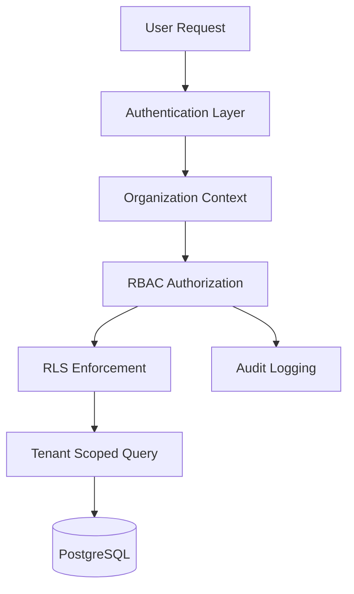

<p align="center">
  
</p>

<p align="center">
  
  
  
  
</p>

<p align="center">
  Production-inspired SaaS architecture showcase focused on tenant-aware backend systems, RBAC authorization, RLS enforcement, and scalable organization-based infrastructure.
</p>

---

# 🧠 Overview

This repository demonstrates modern multi-tenant SaaS architecture patterns designed for scalability, tenant isolation, operational reliability, and enterprise-grade authorization systems.

The focus is backend systems architecture and production-inspired SaaS infrastructure patterns rather than a complete application build.

<p align="center">
  
</p>

<p align="center">
  
  
  
</p>

---

# ⚡ Core Architecture Goals

- Tenant-aware infrastructure
- Role-based authorization systems
- PostgreSQL RLS patterns
- Organization/workspace isolation
- Audit logging and traceability
- Scalable backend modularity
- Operational reliability
- Secure multi-user collaboration

---

# 🏢 Multi-Tenant Architecture

Core concepts demonstrated in this repository:

- organization-based system design
- tenant isolation strategies
- RBAC authorization models
- RLS enforcement patterns
- tenant-scoped queries
- modular backend domains
- workspace-level permissions
- secure data boundaries



---

# 📊 Architecture Diagrams

- [🏢 Tenant Architecture](./diagrams/tenant-architecture.md)
- [🔐 Permissions Flow](./diagrams/permissions-flow.md)
- [🗄️ Database Relationships](./diagrams/database-relations.md)
- [👥 Organization Structure](./diagrams/org-structure.md)

---

# 🔐 Security & Authorization

The architecture prioritizes:

- strict tenant isolation
- role-based access control
- row-level security
- secure backend boundaries
- permission-aware queries
- auditability
- scoped API access
- protected operational workflows

---

# ⚖️ Design Trade-offs

| Trade-off | Benefit | Cost |
|---|---|---|
| Strict tenant isolation | Stronger security boundaries | Increased query complexity |
| RLS enforcement | Database-level protection | Operational debugging overhead |
| RBAC abstraction | Flexible permissions | Higher authorization complexity |
| Modular backend domains | Scalability & maintainability | More infrastructure coordination |

---

# 📂 Repository Structure

```txt
architecture/
├── tenant-isolation.md
├── rbac-system.md
├── rls-patterns.md
├── audit-logging.md
└── scalability.md

docs/
├── auth-strategy.md
├── onboarding-flow.md
├── billing-model.md
└── security-patterns.md

examples/
├── tenant-query.ts
├── role-guard.ts
├── rls-policy.sql
└── audit-log.ts

diagrams/
├── tenant-architecture.md
├── permissions-flow.md
├── org-structure.md
└── database-relations.md
```

---

# 🚀 Stack

### Backend & Infrastructure

- TypeScript
- Next.js
- Node.js
- PostgreSQL
- Redis
- Docker

### SaaS Infrastructure

- Prisma ORM
- Supabase RLS
- RBAC authorization systems
- Tenant-aware backend architecture

### Deployment

- Fly.io
- Vercel
- Structured logging
- Operational observability

---

# 👀 How to Review This Repo Quickly

1. Review architecture diagrams and tenant boundaries
2. Explore RBAC and RLS documentation
3. Review tenant-aware query examples
4. Analyze authorization flows and audit logging
5. Evaluate scalability and operational patterns

---

<p align="center">
  Built with a security-first and tenant-aware systems architecture mindset.
</p>

# 📜 License

MIT