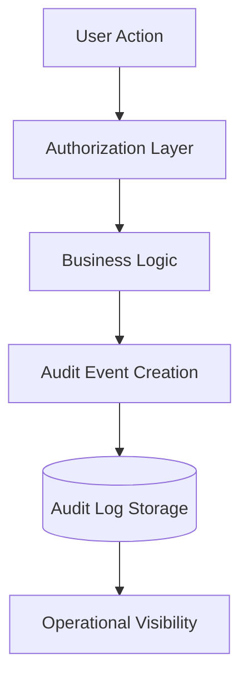

# 📋 Audit Logging Architecture

Audit logging is critical for operational visibility, compliance, security analysis, and tenant-aware activity tracing in multi-tenant SaaS systems.

---

# ⚡ Goals

The audit logging layer provides:

- tenant-scoped activity tracking
- privileged action visibility
- operational traceability
- security event monitoring
- backend accountability

---

# 🧠 Audit Flow

---

# 📦 Logged Events

The architecture demonstrates logging for:

- authentication events
- permission changes
- role assignments
- organization actions
- billing operations
- administrative workflows

---

# 🔒 Security Benefits

Audit logging improves:

- operational accountability
- tenant traceability
- security analysis
- privileged action monitoring
- incident investigation

---

# 🚀 Operational Considerations

Important considerations include:

- event retention policies
- sensitive data masking
- scalable event storage
- searchable operational logs
- tenant-scoped audit queries