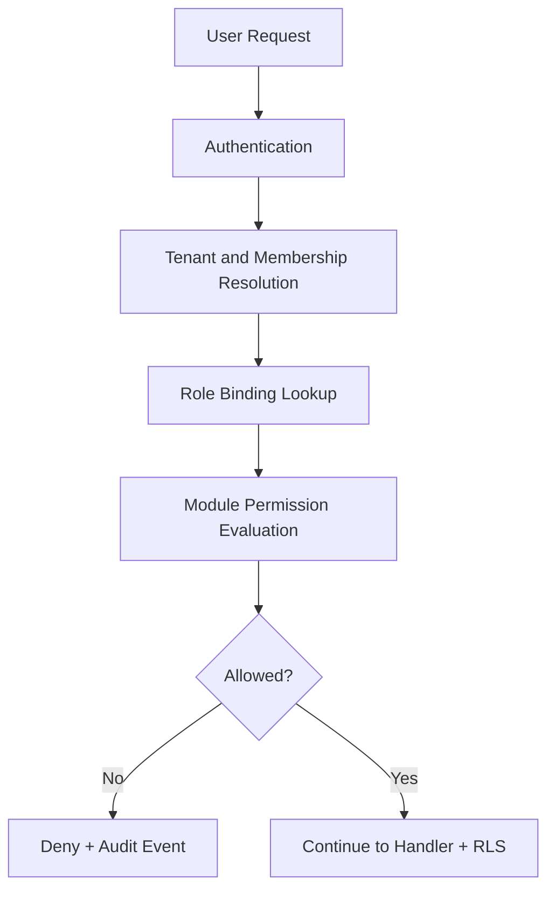

# 🔐 RBAC Authorization System

This document describes production-inspired RBAC patterns for multi-tenant applications where customer, vendor, and internal operator permissions must remain clearly separated.

---

# ⚡ Goals

The authorization layer is designed to provide:

- tenant-aware permission evaluation
- module-scoped operational access
- organization/workspace role bindings
- consistent backend authorization enforcement
- controlled privileged tooling access

---

# 🧠 Authorization Flow

---

# 👥 Example Roles

| Role | Access Scope |
|---|---|
| Tenant Owner | Organization-wide governance and role delegation |
| Operations Manager | Day-to-day operational workflows |
| Support Agent | Case and communication workflows |
| Vendor Manager | Partner-scoped catalog and order tasks |
| Finance Operator | Billing and payout module access |
| Read-Only Analyst | Reporting and audit visibility |

---

# 🔒 Authorization Principles

The architecture prioritizes:

- least-privilege access
- deny-by-default permissions
- organization-aware role bindings
- backend enforcement before data access
- auditability of privileged actions

---

# 📦 RBAC Patterns

Patterns demonstrated include:

- route and handler guards
- module-level permission matrices
- membership-bound role assignment
- scoped API authorization checks
- protected internal operation workflows
- denied-access event logging for forensic review

## ⚖️ Operational Trade-offs

- richer role models improve safety but increase testing surface
- coarse roles speed onboarding but can over-grant access
- over-fragmented permissions can slow product delivery if unmanaged