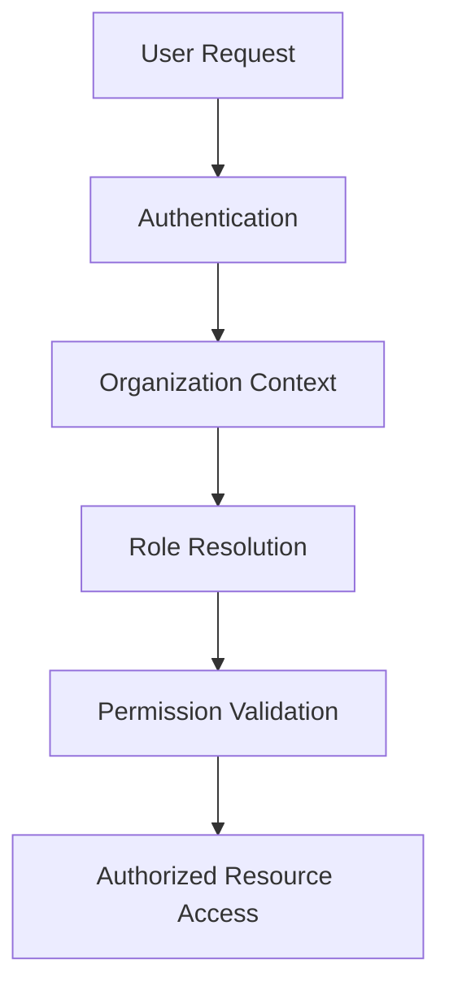

# 🔐 RBAC Authorization System

This document explains the role-based access control patterns used throughout the multi-tenant SaaS architecture.

---

# ⚡ Goals

The authorization layer is designed to provide:

- tenant-aware permissions
- scoped operational access
- organization-level roles
- backend authorization consistency
- secure internal tooling access

---

# 🧠 Authorization Flow

---

# 👥 Example Roles

| Role | Access Scope |
|---|---|
| Admin | Full organization access |
| Operations | Operational workflows |
| Support | Ticketing & CRM access |
| Vendor | Vendor-scoped resources |
| Analyst | Analytics & reporting |
| Finance | Billing & financial systems |

---

# 🔒 Authorization Principles

The architecture prioritizes:

- least-privilege access
- scoped permissions
- organization-aware policies
- backend authorization enforcement
- auditability of privileged actions

---

# 📦 RBAC Patterns

Patterns demonstrated include:

- role guards
- permission matrices
- scoped API authorization
- protected admin workflows
- backend middleware enforcement
- tenant-aware permission resolution