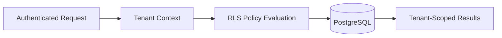

# 🗄️ PostgreSQL RLS Patterns

Row-Level Security (RLS) provides database-level enforcement for tenant-aware SaaS systems.

This architecture demonstrates generalized RLS patterns for secure multi-tenant infrastructure.

---

# ⚡ Why RLS?

Application-only authorization introduces risks such as:

- accidental cross-tenant access
- insecure query filtering
- inconsistent permission enforcement
- backend logic drift

RLS enforces security directly at the database layer.

---

# 🧠 RLS Workflow

---

# 🔒 Example Policy Concepts

The architecture demonstrates:

- organization-scoped rows
- tenant-aware filtering
- user membership validation
- role-aware database access
- backend-safe query execution

---

# 📦 Security Benefits

RLS improves:

- tenant isolation
- backend consistency
- operational safety
- permission enforcement
- auditability

---

# 🚀 Production Considerations

Important operational considerations include:

- query performance
- indexing strategy
- policy complexity
- authorization debugging
- migration safety