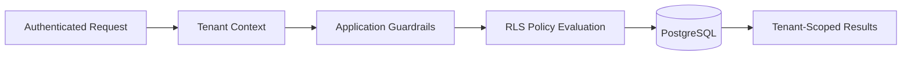

# 🗄️ PostgreSQL RLS Patterns

Row-Level Security (RLS) provides database-level enforcement for tenant-aware SaaS systems.

This architecture demonstrates generalized RLS patterns for secure shared-database infrastructure.

---

# ⚡ Why RLS?

Application-only authorization introduces risks such as:

- accidental cross-tenant access
- insecure query filtering
- inconsistent permission enforcement
- backend logic drift

RLS enforces data visibility constraints directly at the storage boundary.

---

# 🧠 RLS Workflow

---

# 🔒 Example Policy Concepts

The architecture demonstrates:

- organization and workspace-scoped rows
- membership-aware row visibility
- role-sensitive modification rules
- default deny behavior for unmatched context
- privileged service paths separated from user-context queries

---

# 📦 Security Benefits

RLS improves:

- tenant isolation
- backend consistency
- operational safety
- permission enforcement
- auditability

---

# 🚀 Production Considerations

Important operational considerations include:

- policy/index alignment
- query planner behavior under policy predicates
- policy drift during rapid schema evolution
- debugging denied access without leaking sensitive metadata
- migration safety for high-traffic systems

## ⚖️ RLS Trade-offs

- RLS reduces accidental leaks but can hide poor query design until scale.
- Fine-grained policies improve control but increase cognitive load for engineers.