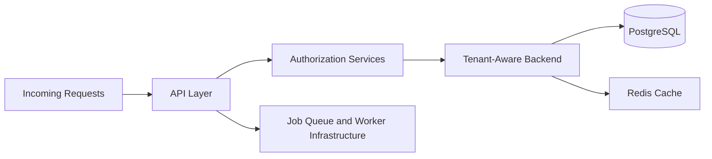

# 📈 Scalability Patterns

Scalable SaaS systems must support growing tenant workloads, operational expansion, and increasing authorization complexity.

---

# ⚡ Scalability Goals

The architecture prioritizes:

- tenant-aware backend scaling
- modular service boundaries
- scalable authorization systems
- isolated operational domains
- predictable infrastructure growth
- controlled multi-portal expansion

---

# 🧠 Scalability Workflow

---

# 📦 Scalability Patterns

The architecture demonstrates:

- modular backend domains
- organization-aware APIs
- caching strategies
- worker offloading
- async operational workflows
- scalable query boundaries
- integration workflow isolation

---

# 🚀 Operational Scaling Areas

Key scalability concerns include:

- organization growth
- query performance
- RBAC complexity
- audit log volume
- operational concurrency
- tenant onboarding expansion
- webhook and scheduler throughput

---

# 🔒 Reliability Considerations

The architecture prioritizes:

- bounded operational domains
- scalable authorization checks
- infrastructure resilience
- operational observability
- failure isolation

## ⚖️ Real-World Trade-offs

- centralized monoliths reduce early complexity but need strict module boundaries as teams grow
- in-memory rate limiting is fast but not globally consistent across instances
- queue-backed workflows improve resiliency but add idempotency and retry complexity