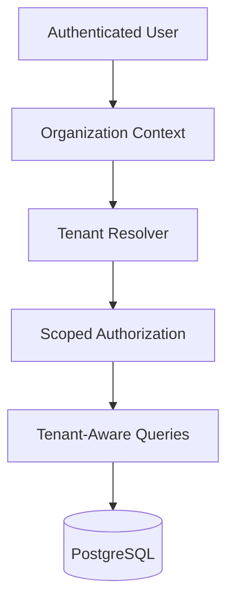

# 🏢 Tenant Isolation Architecture

Multi-tenant SaaS systems must ensure strong logical separation between organizations, users, and operational data.

This repository demonstrates production-inspired tenant isolation patterns designed for scalable backend infrastructure and secure multi-organization systems.

---

# ⚡ Core Isolation Goals

The architecture prioritizes:

- organization-level isolation
- tenant-scoped data access
- secure backend boundaries
- permission-aware query execution
- operational separation between tenants
- auditability and traceability

---

# 🧠 Isolation Model

Each request is resolved within an explicit tenant context.

---

# 🔒 Tenant-Aware Querying

All backend operations must include:

- organization context
- tenant-scoped identifiers
- RBAC permission validation
- RLS enforcement

Example constraints:

- users can only access assigned organizations
- vendor accounts only access vendor-scoped data
- internal roles operate within authorized domains
- admin operations are audit-logged

---

# 📦 Isolation Strategies

The architecture demonstrates:

- shared database / isolated tenant rows
- organization-scoped queries
- RLS-based protection
- scoped API boundaries
- workspace-aware authorization

---

# 🚀 Scalability Benefits

Tenant isolation enables:

- scalable SaaS onboarding
- secure organization expansion
- permission-aware workflows
- operational safety
- scalable backend modularity