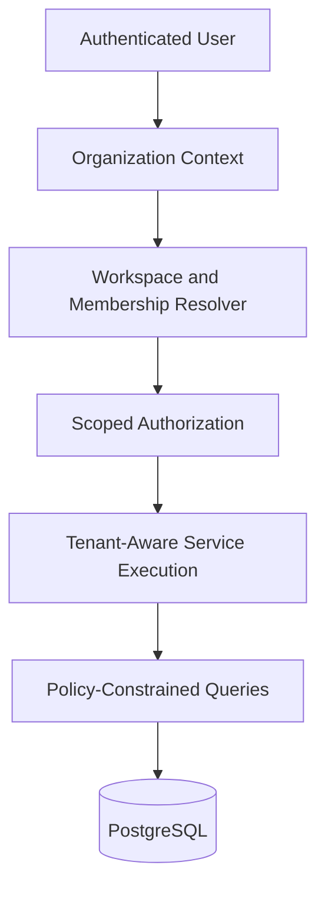

# 🏢 Tenant Isolation Architecture

Multi-tenant SaaS systems rely on explicit tenant context propagation from request entry to database access.

This document captures generalized patterns for organization/workspace separation, permission boundaries, and operational safety in shared infrastructure.

## 🌐 Production SaaS Context

Inspired by architecture patterns commonly needed in:

- [Peacock Wholesale](https://peacockwholesale.io)
- [Peacock OMS](https://oms.peacockwholesale.io)

This is intentionally sanitized and does not describe private implementations.

---

# ⚡ Core Isolation Goals

The architecture prioritizes:

- organization-level ownership boundaries
- workspace-level operational segmentation
- tenant-scoped query construction
- secure boundaries between vendor/admin/customer surfaces
- auditability for privileged operations
- safe cross-tenant reporting controls

---

# 🧠 Isolation Model

Each request is resolved inside an explicit tenant envelope.

---

# 🔒 Tenant-Aware Querying

Every backend operation should carry:

- organization context
- workspace or module scope
- actor identity and role claims
- app-layer authorization checks
- policy-backed data constraints

Common constraints:

- users can operate only within active memberships
- vendor-facing actors cannot access internal operator modules
- internal operators are restricted by module scopes, not just login state
- high-risk actions emit audit events with tenant context

---

# 📦 Isolation Strategies

The architecture demonstrates:

- shared database with strict tenant filters
- route-domain segregation for role audiences
- membership-driven permission resolution
- RLS enforcement for tenant-owned data paths
- explicit privileged paths for operational workflows

---

# 🚀 Scalability Benefits

Tenant isolation enables:

- predictable onboarding and expansion
- safer organizational growth without schema duplication
- clearer blast-radius containment during incidents
- reusable service modules with tenant-safe defaults
- maintainable authorization as roles and workflows evolve

## ⚖️ Trade-offs

- stricter isolation increases authorization complexity
- policy-heavy systems require deeper testing and observability
- tenant-scoped analytics can become expensive without data modeling discipline