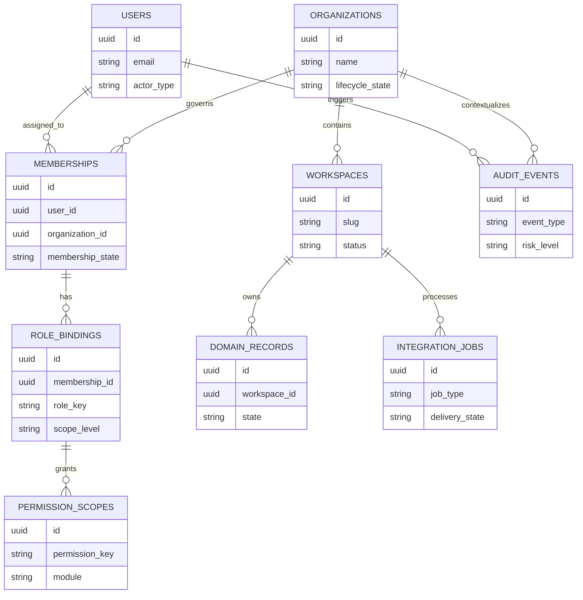

# 🗄️ Database Relationships

```mermaid
erDiagram

USERS ||--o{ MEMBERSHIPS : assigned_to
ORGANIZATIONS ||--o{ WORKSPACES : contains
ORGANIZATIONS ||--o{ MEMBERSHIPS : governs
MEMBERSHIPS ||--o{ ROLE_BINDINGS : has
ROLE_BINDINGS ||--o{ PERMISSION_SCOPES : grants
WORKSPACES ||--o{ DOMAIN_RECORDS : owns
USERS ||--o{ AUDIT_EVENTS : triggers
ORGANIZATIONS ||--o{ AUDIT_EVENTS : contextualizes
WORKSPACES ||--o{ INTEGRATION_JOBS : processes

USERS {
  uuid id
  string email
  string actor_type
}

ORGANIZATIONS {
  uuid id
  string name
  string lifecycle_state
}

WORKSPACES {
  uuid id
  string slug
  string status
}

MEMBERSHIPS {
  uuid id
  uuid user_id
  uuid organization_id
  string membership_state
}

ROLE_BINDINGS {
  uuid id
  uuid membership_id
  string role_key
  string scope_level
}

PERMISSION_SCOPES {
  uuid id
  string permission_key
  string module
}

DOMAIN_RECORDS {
  uuid id
  uuid workspace_id
  string state
}

AUDIT_EVENTS {
  uuid id
  string event_type
  string risk_level
}

INTEGRATION_JOBS {
  uuid id
  string job_type
  string delivery_state
}
```

> This ERD is intentionally conceptual. It models multi-tenant boundaries and permission relationships without exposing private production schemas.