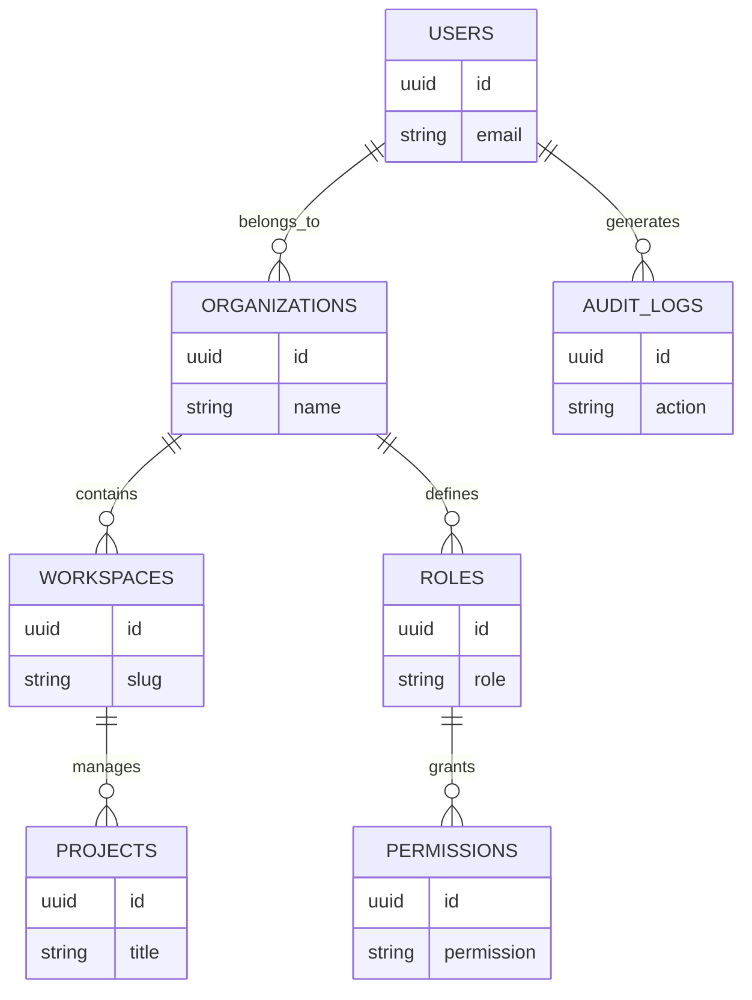

# 🗄️ Database Relationships

```mermaid
erDiagram

USERS ||--o{ ORGANIZATIONS : belongs_to
ORGANIZATIONS ||--o{ WORKSPACES : contains
WORKSPACES ||--o{ PROJECTS : manages
ORGANIZATIONS ||--o{ ROLES : defines
ROLES ||--o{ PERMISSIONS : grants
USERS ||--o{ AUDIT_LOGS : generates

USERS {
  uuid id
  string email
}

ORGANIZATIONS {
  uuid id
  string name
}

WORKSPACES {
  uuid id
  string slug
}

PROJECTS {
  uuid id
  string title
}

ROLES {
  uuid id
  string role
}

PERMISSIONS {
  uuid id
  string permission
}

AUDIT_LOGS {
  uuid id
  string action
}
```