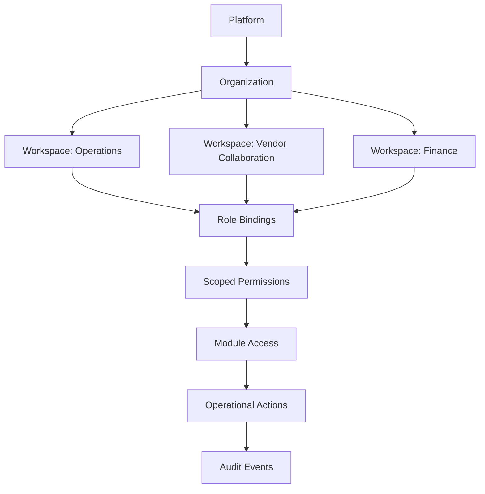

# 👥 Organization Structure

### Structure Principles

- Organizations are the primary tenancy boundary.
- Workspaces segment operational responsibilities within a tenant.
- Role bindings are attached to memberships, not global users.
- Permissions are module-scoped to reduce blast radius.
