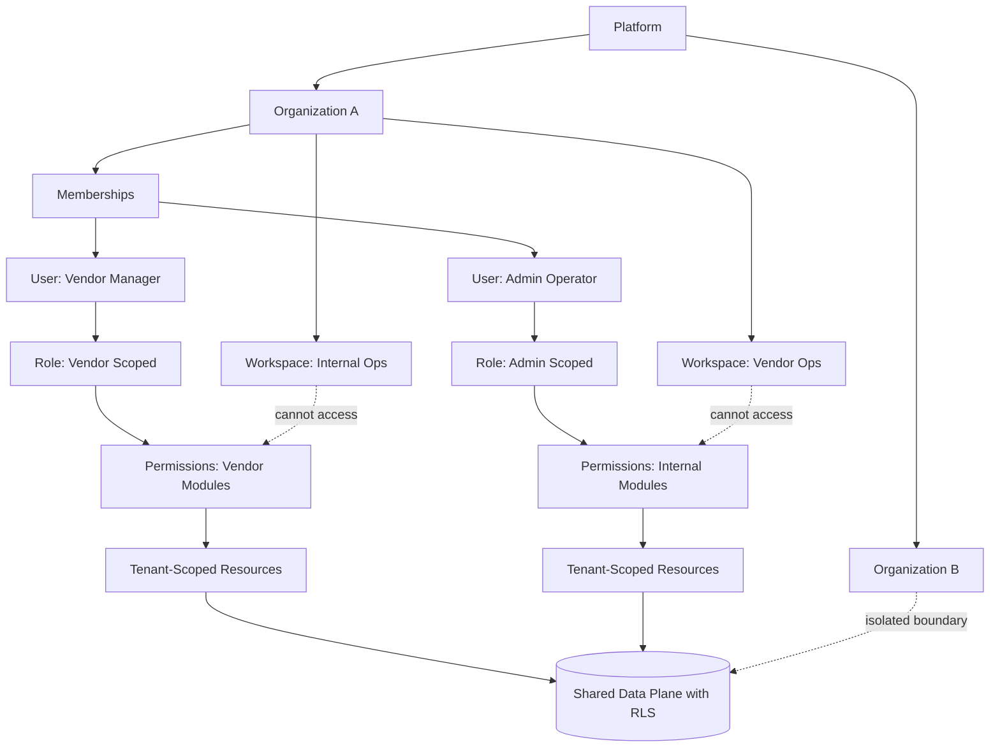

# 🧱 Organization Workspace Boundaries

## Boundary Notes

- Organization is the primary tenant boundary.
- Workspaces separate operational contexts inside a tenant.
- Roles and permissions are bound to memberships, not globally to users.
- Vendor and admin surfaces are isolated by module-level permission scopes.
- Data remains tenant-scoped even in a shared database model.
