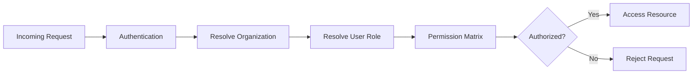

# 🔐 Permissions Flow

```mermaid
flowchart LR

A[Incoming Request]
--> B[Authentication]

B --> C[Resolve Organization]

C --> D[Resolve User Role]

D --> E[Permission Matrix]

E --> F{Authorized?}

F -->|Yes| G[Access Resource]

F -->|No| H[Reject Request]
```