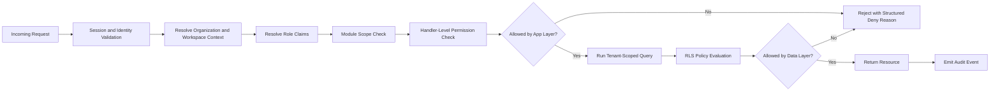

# 🔐 Permissions Flow

### Why this flow matters

- App-layer checks stop unauthorized workflows early.
- RLS remains the final gate for row visibility.
- Deny outcomes are logged for security review and troubleshooting.