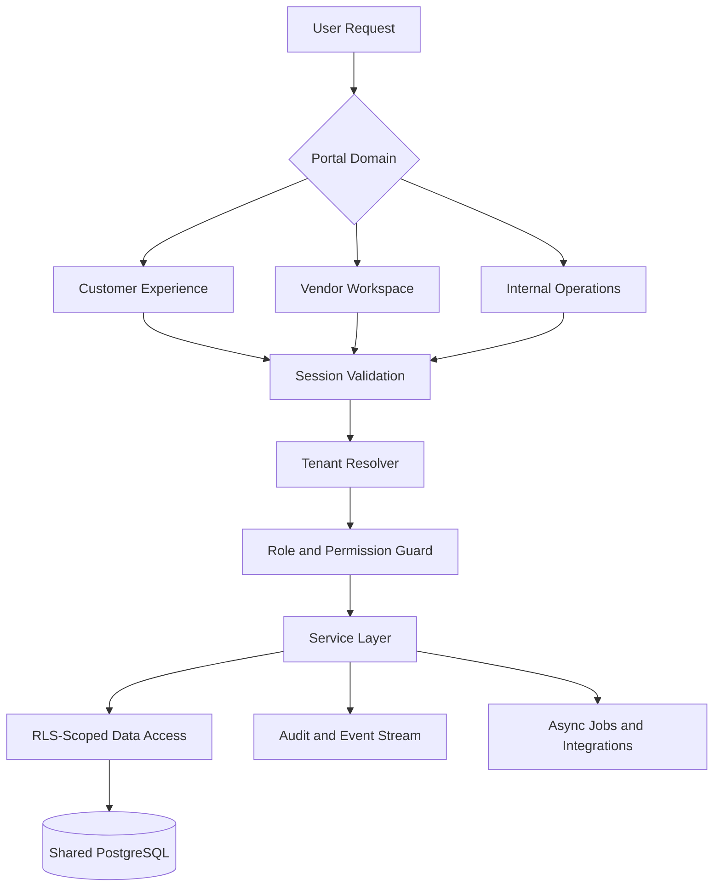

# 🏢 Tenant Architecture

### Design Notes

- Distinct portal domains reduce accidental privilege crossover.
- Tenant context is resolved before business logic is executed.
- Service guards and database policies are complementary controls.
- Operational jobs run outside request latency paths, but remain tenant-aware.