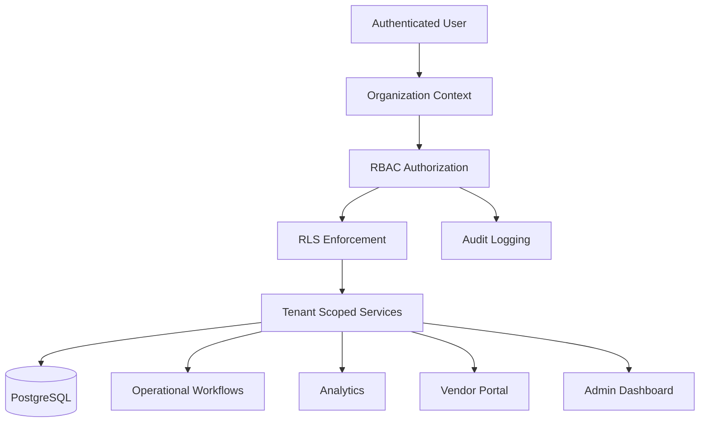

# 🏢 Tenant Architecture

```mermaid
flowchart TD

A[Authenticated User]
--> B[Organization Context]

B --> C[RBAC Authorization]

C --> D[RLS Enforcement]

D --> E[Tenant Scoped Services]

E --> F[(PostgreSQL)]

C --> G[Audit Logging]

E --> H[Operational Workflows]

E --> I[Analytics]

E --> J[Vendor Portal]

E --> K[Admin Dashboard]
```