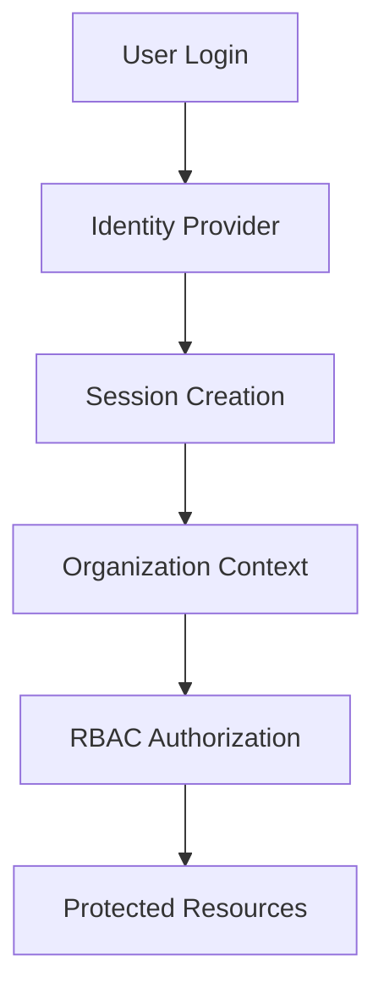

# 🔑 Authentication Strategy

This document outlines the authentication and session management patterns used throughout the multi-tenant SaaS architecture.

---

# ⚡ Goals

The authentication layer is designed to provide:

- secure user authentication
- organization-aware sessions
- tenant-scoped access control
- protected operational workflows
- scalable identity management

---

# 🧠 Authentication Flow

---

# 🔒 Session Principles

The architecture prioritizes:

- short-lived access tokens
- secure refresh workflows
- organization-aware sessions
- backend session validation
- permission-aware APIs

---

# 📦 Supported Patterns

The repository demonstrates generalized support for:

- OAuth providers
- email/password authentication
- organization invitations
- session-based authorization
- tenant-aware identity resolution

---

# 🚀 Security Considerations

Important operational considerations include:

- token expiration
- session invalidation
- role revocation
- organization switching
- secure backend validation