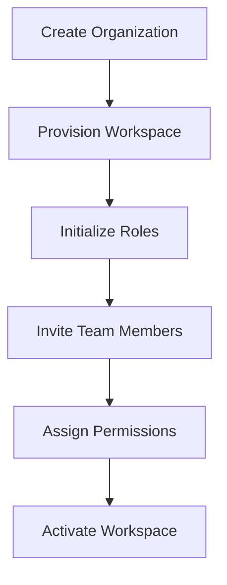

# 🚀 Organization Onboarding Flow

This document explains the onboarding lifecycle for new organizations entering the SaaS platform.

---

# ⚡ Goals

The onboarding system is designed to provide:

- scalable tenant provisioning
- organization initialization
- secure workspace creation
- role-aware invitations
- operational consistency
- staged activation with guardrails

---

# 🧠 Onboarding Workflow

---

# 📦 Provisioning Steps

The onboarding workflow includes:

- organization creation
- workspace initialization
- default role setup
- tenant-scoped resource provisioning
- onboarding invitations
- operational configuration
- compliance and verification checkpoints

---

# 🔒 Security Considerations

The onboarding process prioritizes:

- secure invitation flows
- organization ownership validation
- permission-aware onboarding
- protected setup workflows
- least-privilege defaults for first-time roles

---

# 🚀 Scalability Benefits

Structured onboarding improves:

- operational consistency
- tenant provisioning
- scalable customer onboarding
- workspace standardization
- backend maintainability

## ⚖️ Operational Trade-offs

- rigid onboarding improves safety but can increase time-to-first-value
- flexible onboarding is faster but risks inconsistent tenant configuration