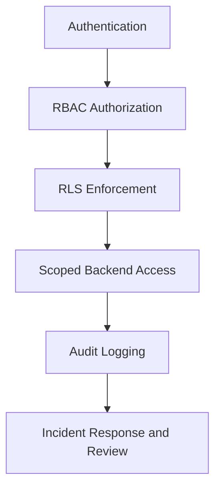

# 🛡️ Security Patterns

Secure SaaS infrastructure requires layered backend protections and tenant-aware operational safeguards.

---

# ⚡ Security Goals

The architecture prioritizes:

- tenant isolation
- backend authorization enforcement
- protected operational workflows
- secure API boundaries
- auditability
- least-privilege access
- explicit trust boundary separation

---

# 🔒 Core Security Layers

---

# 🧠 Security Principles

The architecture demonstrates:

- organization-scoped permissions
- backend authorization guards
- protected admin workflows
- role-aware APIs
- audit logging
- secure operational tooling
- separated vendor and internal operator boundaries

---

# 🚦 Operational Protections

The system supports:

- rate limiting
- scoped API tokens
- session expiration
- protected infrastructure actions
- role-aware workflow execution
- high-risk action review logging

---

# 📈 Security Considerations

Production-focused concerns include:

- permission escalation prevention
- operational auditability
- backend trust boundaries
- sensitive workflow protection
- infrastructure access controls
- policy drift between app-layer and data-layer authorization